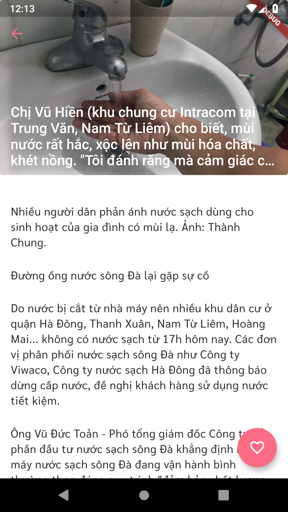

## Tnews
[](https://app.fossa.io/projects/git%2Bgithub.com%2Ftnews%2Ftnews?ref=badge_shield)

Project cross-platform for read news easy

## Getting Started

Clone this project:
```bash
git clone https://github.com/tnews/tnews.git
```
Get packages:

```bash
flutter pub get
```

Run project:

```bash
flutter run
```

## Some screen shot
[](screen_shots/listing.png)
<span><span/>
<span><span/>
<span><span/>
<span><span/>

## License
[](https://app.fossa.io/projects/git%2Bgithub.com%2Ftnews%2Ftnews?ref=badge_large)